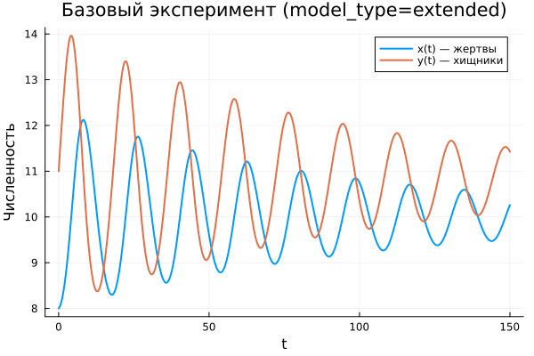
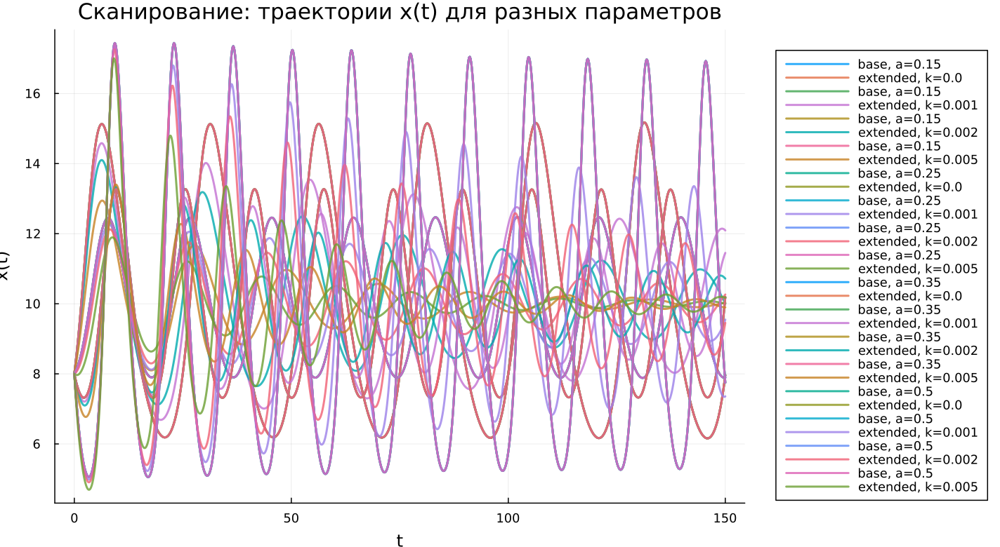
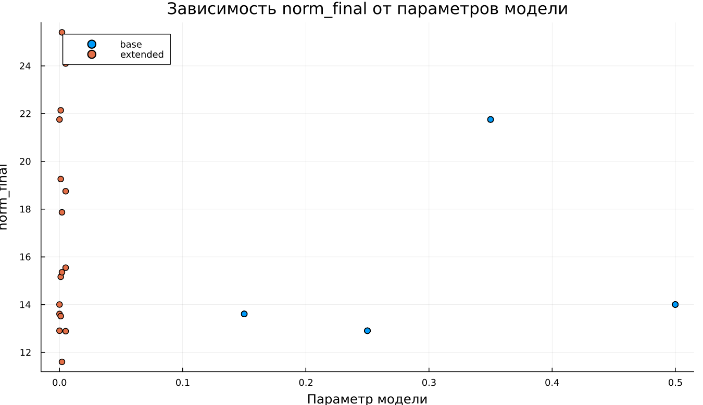

---
## Author
author:
  name: Ванчинга Дэвид
  email: 1032215801@rudn.ru
  affiliation:
    - name: Российский университет дружбы народов
      country: Российская Федерация
      postal-code: 117198
      city: Москва
      address: ул. Миклухо-Маклая, д. 6

## Title
title: "Математическое моделирование"
subtitle: "Лабораторная работа № 5"
license: "CC BY"
---

# Цель работы

Исследовать динамику системы типа «хищник–жертва» и проанализировать её поведение.

# Задание

1. Построить фазовую зависимость $x(y)$, а также графики $x(t)$ и $y(t)$  
2. Определить стационарные значения системы  

# Выполнение лабораторной работы

## Теоретические сведения

В работе изучается математическая модель взаимодействия популяций «хищник–жертва».

Рассмотрим систему, состоящую из $X$ хищников и $Y$ жертв. Предполагается выполнение следующих условий (модель Лотки–Вольтерры):

1. Численности популяций зависят только от времени, пространственное распределение не учитывается  
2. Без взаимодействия виды подчиняются закону Мальтуса: жертвы увеличиваются, хищники сокращаются  
3. Естественные процессы (смертность жертв и рождаемость хищников) считаются пренебрежимо малыми  
4. Ограничения на рост популяций отсутствуют  
5. Взаимодействие видов описывается следующим образом:

$$
\begin{cases}
\frac{dx}{dt} = -a x(t) + b x(t) y(t) \\
\frac{dy}{dt} = c y(t) - d x(t) y(t)
\end{cases}
$$

где $a$ — коэффициент убыли хищников, $b$ — коэффициент их воспроизводства,  
$c$ — коэффициент роста жертв, $d$ — коэффициент их гибели.

Система обладает особым состоянием равновесия, при котором изменения отсутствуют:

$$
\frac{dx}{dt} = 0, \quad \frac{dy}{dt} = 0
$$

При условиях $x>0$, $y>0$ стационарная точка имеет вид:

$$
x_0 = \frac{a}{b}, \quad y_0 = \frac{c}{d}
$$

## Задача

Рассматривается система:

$$
\begin{cases}
\frac{dx}{dt} = -0.25x(t) + 0.025x(t)y(t) \\
\frac{dy}{dt} = 0.45y(t) - 0.045x(t)y(t)
\end{cases}
$$

Требуется:

- построить графики $x(t)$ и $y(t)$  
- изобразить фазовую зависимость  
- найти стационарное состояние  

Начальные условия: $x_0 = 8$, $y_0 = 11$

Стационарная точка:

$$
x_0 = \frac{a}{b} = 10, \quad y_0 = \frac{c}{d} = 10
$$

Для моделирования применялись внешние программные модули:





## Базовые эксперименты

### Базовая модель (model_type = base)

Графики временных зависимостей демонстрируют регулярные колебания обеих переменных. Значения $x(t)$ и $y(t)$ изменяются периодически, причём амплитуда остаётся практически неизменной.

Такое поведение характерно для классической модели без диссипации: система сохраняет энергию и не стремится к равновесию.

Фазовый портрет представляет собой замкнутую траекторию, что подтверждает циклический характер динамики.

### Расширенная модель (model_type = extended)

В данной модели колебания сохраняются, однако их амплитуда со временем уменьшается.

Причина заключается во введении дополнительного члена $-k x^2$, ограничивающего рост популяции жертв. Это приводит к потере консервативности системы.

Фазовый портрет имеет форму спирали, сходящейся к точке равновесия, что указывает на устойчивость состояния.

Таким образом, система постепенно переходит к стационарному режиму.

## Параметрическое сканирование

### Траектории $x(t)$ для различных параметров

Проведено исследование влияния параметров:

- в базовой модели варьировался параметр $a$  
- в расширенной модели изменялся параметр $k$  

Для базовой модели изменение $a$ влияет на форму колебаний, но не устраняет их периодичность.

В расширенной модели увеличение $k$ ускоряет затухание и приближает систему к устойчивому состоянию.

Основные результаты:

- базовая модель остаётся колебательной  
- расширенная — стремится к равновесию  
- параметры изменяют характеристики динамики  

### Траектории $y(t)$ для различных параметров

Анализ показывает аналогичную картину:  

- в базовой модели сохраняются устойчивые колебания  
- в расширенной — амплитуда уменьшается и устанавливается стационарный уровень  

### Фазовые траектории для различных параметров

Фазовые портреты подчёркивают различия:

- базовая модель → замкнутые циклы  
- расширенная модель → спиральное сходжение  

Это подтверждает различную природу динамики систем.

## Анализ метрики norm_final

Рассматривалась величина:

$$
\text{norm\_final} = \sqrt{x(t_{final})^2 + y(t_{final})^2}
$$

В базовой модели значение метрики остаётся значительным, так как система не достигает равновесия.

В расширенной модели метрика отражает положение устойчивого состояния, к которому система стремится.

## Время вычислений

Результаты показывают, что вычислительные затраты остаются малыми.

Изменение параметров $a$ и $k$ практически не влияет на время расчёта.

Добавление нелинейного члена не приводит к существенному усложнению вычислений.

## Выводы

1. Базовая модель характеризуется незатухающими колебаниями  
2. Расширенная модель демонстрирует стабилизацию и выход на равновесие  
3. Фазовые портреты отражают различие динамических режимов  
4. Параметры влияют на форму и скорость процессов  
5. Метрика $\text{norm\_final}$ позволяет различать типы поведения  
6. Численные методы показывают высокую эффективность  

# Список литературы {.unnumbered}

1. [Модель Лотки-Вольтерры](https://math-it.petrsu.ru/users/semenova/MathECO/Lections/Lotka_Volterra.pdf)
2. [Lotka-Volterra System](https://www.sciencedirect.com/topics/mathematics/lotka-volterra-system)
